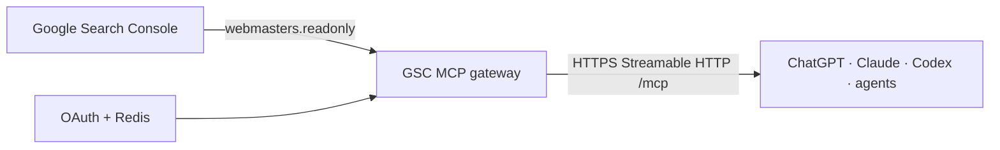

# Architecture

## Selected design

- **Runtime:** Next.js 16 on Node.js, intended for Vercel serverless deployment.
- **MCP:** `mcp-handler` 2.1 with Streamable HTTP at `/mcp` and stateless compatibility for older MCP clients.
- **Client authentication:** OAuth authorization code flow, PKCE S256, dynamic client registration, one-time authorization codes, rotating refresh tokens, and one-hour signed access tokens.
- **OAuth state:** Upstash Redis in remote environments. In-memory state is restricted to tests or explicit local development.
- **Google authentication:** one service account, stored only as a deployment secret, exchanging credentials for Google access tokens with the exact `webmasters.readonly` scope.
- **Google API access:** direct official REST endpoints for Sites, Search Analytics, URL Inspection, and Sitemaps.

The client OAuth token and Google access token are unrelated credentials at separate trust boundaries. AI clients never receive the service-account key or a Google token.

## Data behavior

Search Analytics dates are inclusive. Results are structured and include the selected dimensions, clicks, impressions, CTR, and average position. Google's API returns top rows, not a guaranteed exhaustive export; the gateway repeats that limitation in every analytics response.

`gsc_period_comparison` treats Period A as the baseline. Absolute change is `B - A`. Percentage change is `null` when A is zero. For average position, a positive absolute change is deterioration, and a separate `improvement` value is `A - B`.

The gateway caps a normal analytics call at 5,000 rows and a comparison at 1,000 rows per period. It supports `startRow` for explicit pagination without encouraging oversized agent responses.
